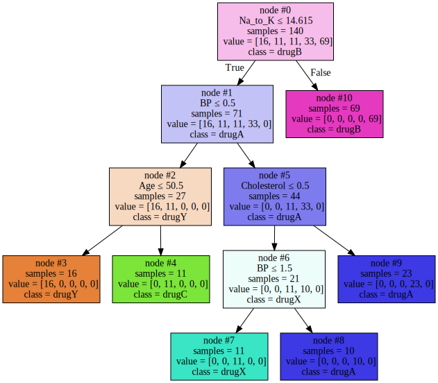

### Utkarsha Vidhale

<h1><center>Decision Trees</center></h1>


<h1>Table of contents</h1>

<div class="alert alert-block alert-info" style="margin-top: 20px">
    <ol>
        <li><a href="#about_dataset">About the dataset</a></li>
        <li><a href="#downloading_data">Downloading the Data</a></li>
        <li><a href="#pre-processing">Pre-processing</a></li>
        <li><a href="#setting_up_tree">Setting up the Decision Tree</a></li>
        <li><a href="#modeling">Modeling</a></li>
        <li><a href="#prediction">Prediction</a></li>
        <li><a href="#evaluation">Evaluation</a></li>
        <li><a href="#visualization">Visualization</a></li>
    </ol>
</div>
<br>
<hr>


Import the Following Libraries:

<ul>
    <li> <b>numpy (as np)</b> </li>
    <li> <b>pandas</b> </li>
    <li> <b>DecisionTreeClassifier</b> from <b>sklearn.tree</b> </li>
</ul>


```python
import numpy as np 
import pandas as pd
from sklearn.tree import DecisionTreeClassifier
import sklearn.externals
import six
```

<div id="about_dataset">
    <h2>About the dataset</h2>
    Imagine that you are a medical researcher compiling data for a study. You have collected data about a set of patients, all of whom suffered from the same illness. During their course of treatment, each patient responded to one of 5 medications, Drug A, Drug B, Drug c, Drug x and y. 
    <br>
    <br>
    Part of your job is to build a model to find out which drug might be appropriate for a future patient with the same illness. The feature sets of this dataset are Age, Sex, Blood Pressure, and Cholesterol of patients, and the target is the drug that each patient responded to.
    <br>
    <br>
    It is a sample of binary classifier, and you can use the training part of the dataset 
    to build a decision tree, and then use it to predict the class of a unknown patient, or to prescribe it to a new patient.
</div>


```python
my_data = pd.read_csv("drug200.csv", delimiter=",")
my_data[0:5]
```


<div>
<style scoped>
    .dataframe tbody tr th:only-of-type {
        vertical-align: middle;
    }

    .dataframe tbody tr th {
        vertical-align: top;
    }

    .dataframe thead th {
        text-align: right;
    }
</style>
<table border="1" class="dataframe">
  <thead>
    <tr style="text-align: right;">
      <th></th>
      <th>Age</th>
      <th>Sex</th>
      <th>BP</th>
      <th>Cholesterol</th>
      <th>Na_to_K</th>
      <th>Drug</th>
    </tr>
  </thead>
  <tbody>
    <tr>
      <th>0</th>
      <td>23</td>
      <td>F</td>
      <td>HIGH</td>
      <td>HIGH</td>
      <td>25.355</td>
      <td>drugY</td>
    </tr>
    <tr>
      <th>1</th>
      <td>47</td>
      <td>M</td>
      <td>LOW</td>
      <td>HIGH</td>
      <td>13.093</td>
      <td>drugC</td>
    </tr>
    <tr>
      <th>2</th>
      <td>47</td>
      <td>M</td>
      <td>LOW</td>
      <td>HIGH</td>
      <td>10.114</td>
      <td>drugC</td>
    </tr>
    <tr>
      <th>3</th>
      <td>28</td>
      <td>F</td>
      <td>NORMAL</td>
      <td>HIGH</td>
      <td>7.798</td>
      <td>drugX</td>
    </tr>
    <tr>
      <th>4</th>
      <td>61</td>
      <td>F</td>
      <td>LOW</td>
      <td>HIGH</td>
      <td>18.043</td>
      <td>drugY</td>
    </tr>
  </tbody>
</table>
</div>


<div href="pre-processing">
    <h2>Pre-processing</h2>
</div>


Using <b>my_data</b> as the Drug.csv data read by pandas, declare the following variables: <br>

<ul>
    <li> <b> X </b> as the <b> Feature Matrix </b> (data of my_data) </li>
    <li> <b> y </b> as the <b> response vector (target) </b> </li>
</ul>


Remove the column containing the target name since it doesn't contain numeric values.


```python
X = my_data[['Age', 'Sex', 'BP', 'Cholesterol', 'Na_to_K']].values
X[0:5]

```


    array([[23, 'F', 'HIGH', 'HIGH', 25.355],
           [47, 'M', 'LOW', 'HIGH', 13.093],
           [47, 'M', 'LOW', 'HIGH', 10.113999999999999],
           [28, 'F', 'NORMAL', 'HIGH', 7.797999999999999],
           [61, 'F', 'LOW', 'HIGH', 18.043]], dtype=object)


Some features in this dataset are categorical such as **Sex** or **BP**. Unfortunately, Sklearn Decision Trees do not handle categorical variables. But still we can convert these features to numerical values. **pandas.get_dummies()**
Convert categorical variable into dummy/indicator variables.


```python
from sklearn import preprocessing
le_sex = preprocessing.LabelEncoder()
le_sex.fit(['F','M'])
X[:,1] = le_sex.transform(X[:,1]) 


le_BP = preprocessing.LabelEncoder()
le_BP.fit([ 'LOW', 'NORMAL', 'HIGH'])
X[:,2] = le_BP.transform(X[:,2])


le_Chol = preprocessing.LabelEncoder()
le_Chol.fit([ 'NORMAL', 'HIGH'])
X[:,3] = le_Chol.transform(X[:,3]) 

X[0:5]

```


    array([[23, 0, 0, 0, 25.355],
           [47, 1, 1, 0, 13.093],
           [47, 1, 1, 0, 10.113999999999999],
           [28, 0, 2, 0, 7.797999999999999],
           [61, 0, 1, 0, 18.043]], dtype=object)


Now we can fill the target variable.


```python
y = my_data["Drug"]
y[0:5]
```


    0    drugY
    1    drugC
    2    drugC
    3    drugX
    4    drugY
    Name: Drug, dtype: object


<hr>

<div id="setting_up_tree">
    <h2>Setting up the Decision Tree</h2>
    We will be using <b>train/test split</b> on our <b>decision tree</b>. Let's import <b>train_test_split</b> from <b>sklearn.cross_validation</b>.
</div>


```python
from sklearn.model_selection import train_test_split
```

Now <b> train_test_split </b> will return 4 different parameters. We will name them:<br>
X_trainset, X_testset, y_trainset, y_testset <br> <br>
The <b> train_test_split </b> will need the parameters: <br>
X, y, test_size=0.3, and random_state=3. <br> <br>
The <b>X</b> and <b>y</b> are the arrays required before the split, the <b>test_size</b> represents the ratio of the testing dataset, and the <b>random_state</b> ensures that we obtain the same splits.


```python
X_trainset, X_testset, y_trainset, y_testset = train_test_split(X, y, test_size=0.3, random_state=3)
```

<hr>

<div id="modeling">
    <h2>Modeling</h2>
    We will first create an instance of the <b>DecisionTreeClassifier</b> called <b>drugTree</b>.<br>
    Inside of the classifier, specify <i> criterion="entropy" </i> so we can see the information gain of each node.
</div>


Print the shape of X_testset and y_testset. Ensure that the dimensions match


```python
# your code


```


```python
drugTree = DecisionTreeClassifier(criterion="entropy", max_depth = 4)
drugTree # it shows the default parameters
```


    DecisionTreeClassifier(criterion='entropy', max_depth=4)


Next, we will fit the data with the training feature matrix <b> X_trainset </b> and training  response vector <b> y_trainset </b>


```python
drugTree.fit(X_trainset,y_trainset)
```


    DecisionTreeClassifier(criterion='entropy', max_depth=4)


<hr>

<div id="prediction">
    <h2>Prediction</h2>
    Let's make some <b>predictions</b> on the testing dataset and store it into a variable called <b>predTree</b>.
</div>


```python
predTree = drugTree.predict(X_testset)
```

You can print out <b>predTree</b> and <b>y_testset</b> if you want to visually compare the prediction to the actual values.


```python
print (predTree [0:5])
print (y_testset [0:5])

```

    ['drugY' 'drugX' 'drugX' 'drugX' 'drugX']
    40     drugY
    51     drugX
    139    drugX
    197    drugX
    170    drugX
    Name: Drug, dtype: object
    

<hr>

<div id="evaluation">
    <h2>Evaluation</h2>
    Next, let's import <b>metrics</b> from sklearn and check the accuracy of our model.
</div>


```python
from sklearn import metrics
import matplotlib.pyplot as plt
print("DecisionTrees's Accuracy: ", metrics.accuracy_score(y_testset, predTree))
```

    DecisionTrees's Accuracy:  0.9833333333333333
    

**Accuracy classification score** computes subset accuracy: the set of labels predicted for a sample must exactly match the corresponding set of labels in y_true.  

In multilabel classification, the function returns the subset accuracy. If the entire set of predicted labels for a sample strictly match with the true set of labels, then the subset accuracy is 1.0; otherwise it is 0.0.


<hr>

<div id="visualization">
    <h2>Visualization</h2>
    Lets visualize the tree
</div>


```python
import pydotplus
import matplotlib.image as mpimg
from sklearn import tree
%matplotlib inline 
```


```python
import graphviz
from sklearn.tree import export_graphviz
export_graphviz(drugTree,
                feature_names=my_data.columns[0:5],
                out_file="drugTree.dot",
                class_names=my_data["Drug"].unique().tolist(),
                filled=True,
                node_ids=True,
                special_characters=True,
                impurity=False,
                label="all",
                leaves_parallel=False)

with open("drugTree.dot") as bamboo_tree_image:
    bamboo_tree_graph = bamboo_tree_image.read()
graphviz.Source(bamboo_tree_graph)
```


    

    


